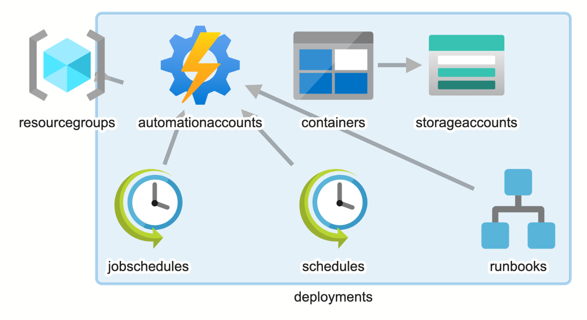

# Azure Table storage backup solution

This simple solution provides periodic automated Azure Table storage backup utilizing Azure automation and powershell runbook, exporting data into .csv file and placing into separate storage account blob container, preferably in a different region. Runbook is setup to run daily.

## Prerequisites
You need to have latest azure compatible powershell installed with respective azure modules for the script to work.
The script was tested in Linux and MacOS. Shoudl be fine with windows as well.

## Contents of the directory

1. Solution deployment powershell script.
2. Azure Resource Manager templates for deploying necessary target resources like storage account.
3. Azure Automation account certificate and connection configuration scripts.

## Access permissions

Azure Automation account uses managed identity, by default having the contributor role assigned on a subscription level during creation. If you would like to have least privileged access applied, and you should definitelly do, use the IAM RBAC permissions assigned as follows:

1. Source Storage Account - Storage Account Contributor Role.
2. Target Storage Account - Storage Account Contributor Role.

## Installation

1. Execute install.ps1 script and supply required values during installation. 
2. Deploy the following Powershell modules following the instruction https://docs.microsoft.com/en-us/azure/automation/shared-resources/modules:
   + Az.Accounts,Az.Automation, Az.Resources, Az.Storage, AzTable
3. Edit powershell runbook in Azure portal called registry backup, to include values for your configuration. 

Change the following sections:

    $sourceRg = "add source recource group name"
    $sourceAccount = "add source storage account name"
    $sourceTable = "add source table name"
    $targetRg = "add source recource group name"
    $targetAccount = "add source storage account name"
    $targetContainer = "add target blob container name"
    $backupname = "add backup file prefix"

Define all table fields you would like to include into backup.
2 mandatory fields (PartitionKey and RowKey) added and one (RequestId) as example:

    $export = $rows | ForEach-Object {
        [PSCustomObject]@{
            "PartitionKey" = $_.PartitionKey
            "RowKey" = $_.RowKey
            "RequestId" = $_.RequestId
        }
    }
4. That's it. Congrats you are done!